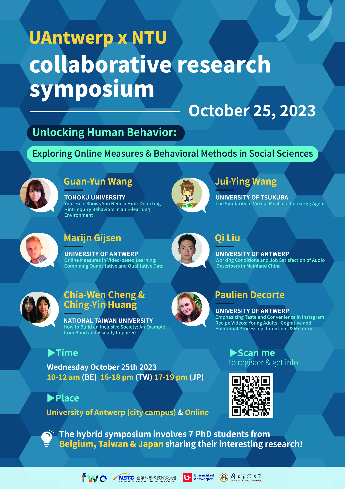

The first [UAntwerp - NTU collaborative research symposium](https://yilunjheng.com/) is supported by both Fonds Wetenschappelijk Onderzoek - Vlaanderen (FWO) and National Science and Technology Council of Taiwan (NSTC, 國家科學及技術委員會).

The symposium is held in a hybrid manner, involving 7 junior researchers (PhD students) from Belgium, Taiwan, and Japan sharing their interesting research!
We warmly welcome anyone from in the world who is interested in using real-time measures and behavioral methods to study topics in the social sciences to join us.
We believe this symposium will be a lot of fun and inspiring! Hope to see you (online or in-person) on Oct 25, 2023!

---

